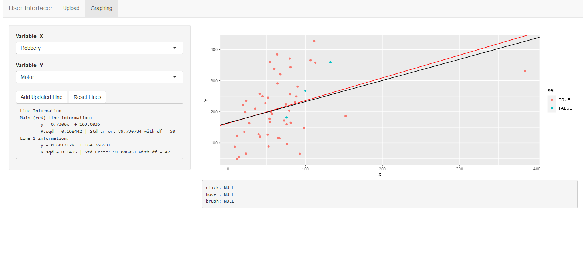

```{r, include = FALSE}
knitr::opts_chunk$set(
  collapse = TRUE,
  comment = "#>"
)
```

```{r setup}
library(MATH5773Skag0011Proj3)
```
## Introduction
When creating a multilinear regression model for any data there are many assumptions we need to meet and often the first choice isn't the best. We may need to look further at some mistakes or unlucky values in the data, or maybe we want to only look at a part of the data. There are multiple functions in this package, each allowing helpful views on a model we want to analyze.

## `MLRModInfo()`
This function helps to analyze the validity of an MLR model. It produces plots that help us check the assumptions of a model and returns a potentially "better" model (chosen by AIC with `step()`). Let's look at an example:
```{r, out.width="100%", fig.width=8, fig.height = 6, fig.align='center'}
ylm <- lm(QUALITY ~ TEMP + PRESSURE + I(TEMP^2) + I(PRESSURE^2) + TEMP:PRESSURE, data = PRODQUAL)
t1 <- MLRModInfo(ylm, PRODQUAL, alpha = 0.05)
```
Notable points from this output is that for the plots, we see that nothing is sufficent for cooks distance (if it were not good we would see a line marking so). The data doesn't look very normal, but we will soon see a test for this. Looking at the residuals, we see that there isn't much to worry about, no weird shape or otherwise. Let's go over to the summary output.
```{r}
summary(t1)
```

Here we can see that no data point has notable high influence. Looking at the Shapiro-Wilk test we see that with a $p$-value of 0.06, we will accept the null that the data is normal. We can then look at some confidence intervals and such. What we see is that the output from the step function is the same model, meaning there weren't sufficient optimizations that could me made to this model to reduce AIC (any removal of terms increased AIC). Let's look at an example where that wasn't the case:
```{r, out.width="100%", fig.width=8, fig.height = 6, fig.align='center'}
butterfat.fit<-lm(Butterfat~Breed+Age+Breed*Age,data=BUTTERFAT)
t1.2 <- MLRModInfo(butterfat.fit, BUTTERFAT)
```
From the command line output, we see that there were reductions made to the model. A slightly better model was Butterfat ~ Breed. We can then look at more info of this model:
```{r}
summary(t1.2$NewModel)
```
To get more plotting information look at:
```{r, out.width="100%", fig.width=8, fig.height = 6, fig.align='center'}
plot(t1.2)
```

## `MLRBootstrap()`
We may not always know what shape of distribution our data takes. Bootstrapping allows us to gain important insights to the data without knowing information about the true distribution. In this function we choose a model and data and run a bootstrap analysis to compare the true sampling distribution and estimates to those found from when we don't sample. Consider the following example on the `BROWSER` data set.
```{r, out.width="100%", fig.width=12, fig.height = 16, fig.align='center'}
t2 <- MLRBootstrap(TIME ~ NUMBER + BROWSER, data = BROWSER, iter = 4000)
```

From this plot output, we are able to look at the sample distribution of each of the $\beta$ estimates. We can also view the center (orange) line to look at where we expect the distribution mean to be. Likewise, we get the $(1 - \alpha)\%$ intervals for the sample (blue) and confidence interval of the theoretical distribution (red). Those can also be viewed numerically in the following output.

```{r}
t2$CI_beta
t2$qbeta

```

Due to how we calculate the $\beta$ values, we can run into some issues. We have the following equation:
$$\beta = (X'X)^{-1}X'Y$$
Where $X$ is the model matrix. What can happen sometimes in bootstrapping is that $(X'X)$ is not always an invertiable matrix, meaning we can't produce a $\beta$ matrix. We may want to look further at the data that caused this issue, this is possible in the function. Here we look at the first sample that wouldn't produce a $\beta$ matrix.
```{r}
BROWSER[t2$failedSamples[[1]],]
```


## `BayesAnalysis()`
This functions let's us run a MLR analyses from a Bayesian perspective. We utilize `MCMCpack` to run these analyses. We have the following assumptions with `MCMCregress()`:

The models is in this form: $$y_i = x_i'\beta + \epsilon_i$$
Where each $\epsilon_i$ is assumed to be Gaussian: $$\epsilon_i \sim \mathcal{N}(0, \sigma^2)$$ 
where: $\sigma^{-2} \sim Gamma(c_0/2, d_0/2)$

We then assume standard, semi-conjugate priors with: $$\beta \sim \mathcal{N}(b_0, B^-1_0)$$

These parameters can be set in `BayesAnalysis()` under the same names as they would in `MCMCregress()` if none are selected, low-impact values are chosen. 

Let's Look at the following example:
```{r, out.width="100%", fig.width=10, fig.height = 12, fig.align='center'}
t3 <- BayesAnalysis(QUALITY ~ TEMP + PRESSURE, PRODQUAL, iter = 10000)
```
Let's first look at the plots. On the left we see the sampled prior distributions of the $\beta$s and $\sigma^2$ described earlier. We have an added red line to show the curve of the distribution and two blue lines refering to $(1-\alpha)\%$ quantile interval of the distribution. 

In the second column we can look at what the distribution appeared to be when it was partially complete (in green) versus the final distribution; this is helpul because we see in this example that the distributions seem to converge to a final distribution (as they look similar). 

In the third column we can see the trace plots to examine the history of the samples to see if they are random enough for this sample.

We have two more plots in this output. The bottom left shows the distributions all on the same plot so we can have a different view of what our distributions look like compared to each other. Here we see that the distirbution of $\siga^2$ is much wider than the others and PRESSURE and TEMP have very similar distributions.

At the bottom right we are given a correlation plot (note a correlation matrix can also be viewed from the return list). Here we have red values refering to negative correlation (like in PRESSURE and (Intercepts)). And positive correlation is given by a blue square (not seen here) the grey is not included as it is the same variable twice.

Similar to in `MLRBootstrap()` we can look at the comparison between the theoretical convidence interval and this distribution:
```{r}
t3$quantiles #Bayesian
t3$CI #Theoretical
```

For a little more information about the posterior we can repeat the output of the function here.
(alternatively use summary(t3$posterior))
```{r}
t3$postSum
```

## `shinyplts()`
This function will run a shiny server app in a new browser window. This function is good for comparing regression lines of a model after removing some data (possibly outliers or only selecting data under a certain parameter). Look at the following screen shots where the red line is the original regression line and the second is only of data bellow a population of $2 \cdot 10^7$ and the third is after removing potential high influence points.





